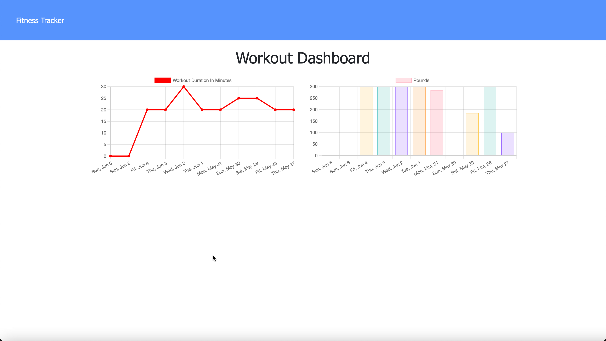

# FitnessTracker
Mongo DB Workout Tracker

## Description
Thius application allows an individual to view create and track daily workouts. You are able to log multiple exercises in a workout on a given day. You are also able to track the name, type, weight, sets, reps, and duration of exercise. If the exercise is a cardio exercise, you are able to track the distance traveled. This app is hosted on Heroku.

[](https://opensource.org/licenses/MIT)

Sample of the Tech Blog application:<br><br>


## Table of Contents
- [Installation](#installation)
- [Usage](#usage)
- [Credits](#credits)
- [License](#license)
- [Questions](#questions)

## Installation
After cloning the repository there are many dependencies so be sure to navigate to the Develop folder and install dependencies identified in package.json. This application runs Express, Mongoose and MongoDB to name a few. There is also an initial seed of the database with several workouts to get you started.<br>
```npm install```<br>
```npm run seed```<br>
```npm start or nodemon server.js```

Github repsitory [FitnessTracker](https://github.com/mark-artim/FitnessTracker)

## Usage

This application is straightforward. From the homepage you are able to start a new workout and add multiple execises to that workout.
- You can start a new workout and can track multiple workouts per day.
- You can add as many exercises as you like to a workout.
- You can continue a workout already started if you need to.
- You can track cardio or resistance exercises nad will be prompted for inormation appropriate for each type.
- Once you complete a workout you are able to view statistics on a dashboard.

<br>

## The live site can be reached by clicking this link: [TechBlog](https://mrafitnesstracker.herokuapp.com)


## Credits
Mim Armand was instrumental in educating me on the technology required for this application as well as Chris Martinez and Jay Yousef for helping me debug issues.

## License
[](https://opensource.org/licenses/MIT)


## How to Contribute
Feel free to fork and make pull requests.

## Tests
**There are no unit or other tests for this project**<BR>

## Questions
If you have any questions please contact me at: <br><br>
**mark.artim@gmail.com**<br><br>
or visit me at<br><br>
[**Github**](https://github.com/mark-artim)
        

